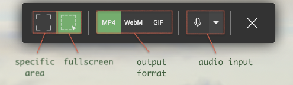

</img>

[CropMon](https://cropmon.pineple.com/) is a utility that provides quick and easy screen recording.

</img>

<br>

## Features

- [x] Record specific screen regions

- [x] Support multi-display recording

- [x] Full screen recording

- [x] Audio (microphone input)

- [x] Various output format (mp4, webm, gif)

- [x] User settings (recording hotkeys, file paths, etc.)

- [ ] Post-editing (TRIM) function

- [ ] Drawing tools while recording

- [ ] Instant streaming feature

<br>

## Downloads

[Mac (Apple Silicon)](https://cropmon.pineple.com/)

[Mac (Intel Chip)](https://cropmon.pineple.com/)

[Windows](https://cropmon.pineple.com/)

<br>

## Usage

### Quick Recording

Press the specified hotkeys `Ctrl (Cmd on Mac) + Shift+Enter` once to enter the mode to select the recording area. Then, when you finish selecting the recording area, it will start recording. To finish recording, you can enter the shortcut again or click the icon in the tray.

### Recording options

</img>

#### Specific Regionize Mode

This mode records a rectangular area of your choice. Click and drag the start point to select the desired area and release the click to record the area immediately.

#### Fullscreen mode

Fullscreen mode records one display as a whole. Position the pointer on the display you want to record to highlight the selection, then click the mouse (or hit enter) to start recording immediately.

### Audio (microphone) input

If you want to record audio as well, simply select the audio source via the arrow next to the microphone icon and click the microphone icon again to toggle whether it's active or not.

> Tips: Mac speaker output requires a [virtual audio device](https://existential.audio/blackhole/)

<br>

## Development

### Prerequisite

```
node >= 18.x
npm >= 8.x
```

### How to build & run

#### Install NPM packages

```bash
$ npm i
```

#### Run by script

```bash
$ npm run start:renderer
$ npm run start:main
```

#### Package as an executable

```bash
$ npm run package
```


### Architecture

TBD

### Contribution

I'm always looking for people to develop with me.
If you have an idea, a bug report, or a PR, please post it here.